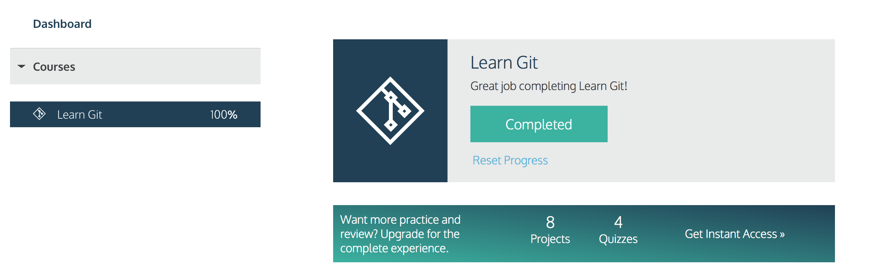

# Girish Malekar

# Where are you from?

From Mumbai, the financial capital of India. A city that never **SLEEPS**.
 
# IT Background

Worked as a Data Analyst for Bombay Stock Exchange.

Girish Malekar is a first-year graduate student at the Illinois Institute Technology Chicago, Information Technology Management, with a keen interest in data management and data analytics. He has completed his MBA in Financial Market from BSE Institute Ltd. and Bachelors of Science in Information Technology from Vidyalankar School of Information Technology.

# Something Interesting about you

Fitness aficionado *would love to be back to the shape i was a year back*. Love to read geo-polictics and financial news from Economist and WSJ. Would love it if you recommend a similar magzine for technology. I love playing games on PS4 it all started with FIFA and I have loyalty to PS4 becasue of God of War trilogy. Love Jhon Grisham and Dan Brown.

# Git Tutorial

